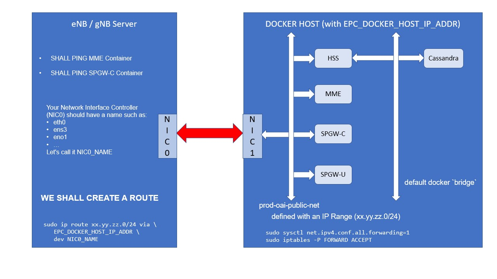

<table style="border-collapse: collapse; border: none;">
  <tr style="border-collapse: collapse; border: none;">
    <td style="border-collapse: collapse; border: none;">
      <a href="http://www.openairinterface.org/">
         
         </img>
      </a>
    </td>
    <td style="border-collapse: collapse; border: none; vertical-align: center;">
      <b><font size = "5">OpenAirInterface Core Network Docker Deployment : Configure Networking</font></b>
    </td>
  </tr>
</table>


**TABLE OF CONTENTS**

1.  [Networking](#1-networking)
2.  [After Deployment](#2-after-deploying-your-cnf-containers)


# 1. Networking #

Accessing a Docker container from the server you've deployed it on is easy.

Accessing a Docker container from another server is NOT.

Here is a picture of what we will be doing:



**The objective is to be able to ping the MME and SPGW-U containers from the eNB server(s)**.


## Step 1 : create a docker network on your EPC docker host. ##

By just deploying the Cassandra container(s), you will create 2 docker networks:

```bash
$ cd docker-compose/oai-mme-legacy
$ docker-compose up -d db_init
Creating network "prod-oai-private-net" with the default driver
Creating network "prod-oai-public-net" with the default driver
Creating prod-cassandra ... done
Creating prod-db-init   ... done
$ docker network ls
NETWORK ID          NAME                       DRIVER              SCOPE
db9d51755702        bridge                     bridge              local
c3605ce9dbf6        host                       host                local
3dffd2ec9ad2        none                       null                local
a2774c5b14ee        prod-oai-private-net       bridge              local
4a2fc2f18d63        prod-oai-public-net        bridge              local
$ docker network inspect prod-oai-public-net 
[
    {
        "Name": "prod-oai-public-net",
...
        "IPAM": {
            "Driver": "default",
            "Options": null,
            "Config": [
                {
                    "Subnet": "192.168.61.192/26"
                }
            ]
        },
        "Internal": false,
        "Attachable": true,
...
    }
]
```

As you can see, the public network (`prod-oai-public-net`) is using the range `192.168.61.192/26`.

If this IP range **DOES NOT** suit your network environment, you have a lot of editing.

## Step 2: create a route on your eNB/gNB server(s) ##

In the servers that are hosting the eNB(s) and/or gNB(s), create IP route(s):

The following are examples. **PLEASE ADAPT TO YOUR ENVIRONMENT.**

```bash
# On minimassive
sudo ip route add 192.168.61.192/26 via 192.168.18.197 dev bond0

# On mozart
sudo ip route add 192.168.61.192/26 via 192.168.18.197 dev nm-bond

# On caracal
sudo ip route add 192.168.61.192/26 via 192.168.18.197 dev nm-bond
```

- Where `192.168.18.197` is the IP address of the **Docker Host**
- Where `bond0` is the **Network Interface Controller(NIC)** of the eNB server (minimassive in our case).
- Where `nm-bond` is the **NIC** of the gNB server (mozart/caracal in our case).

# 2. After deploying your cNF containers #

Normally you did:

```bash
$ docker-compose up -d oai_spgwu
```

## Verify your network configuration ##

Let make sure your routing on the eNB server is correct.

**On your EPC Docker Host:** recover the MME IP address:

```bash
$ docker inspect --format="{{range .NetworkSettings.Networks}}{{.IPAddress}}{{end}}" prod-oai-mme
192.168.61.195
```

You can also find in the `docker-compose.yml` file.

**On your eNB server:**

```bash
$ ping -c 5 192.168.61.195
PING 192.168.61.195 (192.168.61.195) 56(84) bytes of data.
64 bytes from 192.168.61.195: icmp_seq=1 ttl=63 time=0.306 ms
64 bytes from 192.168.61.195: icmp_seq=2 ttl=63 time=0.269 ms
64 bytes from 192.168.61.195: icmp_seq=3 ttl=63 time=0.234 ms
64 bytes from 192.168.61.195: icmp_seq=4 ttl=63 time=0.266 ms
64 bytes from 192.168.61.195: icmp_seq=5 ttl=63 time=0.233 ms

--- 192.168.61.195 ping statistics ---
5 packets transmitted, 5 received, 0% packet loss, time 129ms
rtt min/avg/max/mdev = 0.233/0.261/0.306/0.032 ms
```

Same thing for SPGW-U IP address:

```bash
$ ping -c 5 192.168.61.197
...
5 packets transmitted, 5 received, 0% packet loss, time 129ms
...
```

**NOTE: YOU CAN TRY TO PING THE HSS CONTAINER BUT IT WON'T WORK.**

You are ready to [generate some traffic](./GENERATE_TRAFFIC.md).
