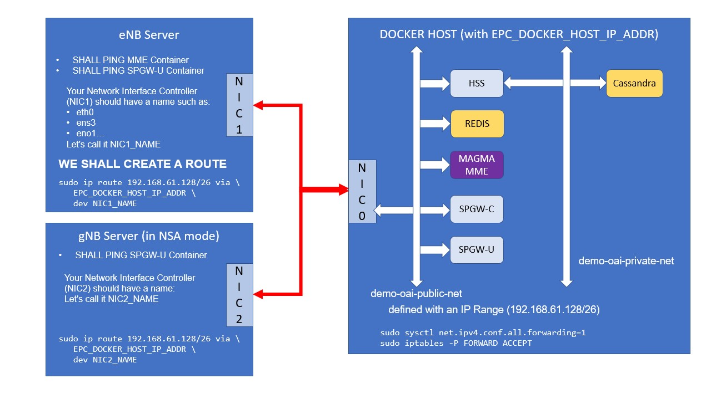

<table style="border-collapse: collapse; border: none;">
  <tr style="border-collapse: collapse; border: none;">
    <td style="border-collapse: collapse; border: none;">
      <a href="http://www.openairinterface.org/">
         
         </img>
      </a>
    </td>
    <td style="border-collapse: collapse; border: none; vertical-align: center;">
      <b><font size = "5">OpenAirInterface 5G MAGMA NSA SUPPORT demo</font></b>
    </td>
  </tr>
</table>


**TABLE OF CONTENTS**

1.  [Verify your connectivity on all servers](#1-verify-your-connectivity-on-all-servers)
2.  [Configuring your eNB and gNB](#2-configuring-your-enb-and-gnb)

Here is a picture of what we will be doing:




# 1. Verify your connectivity on all servers #

The eNB server **SHALL** see the MME and the SPGW-U containers.

The `demo-oai-public-net` docker network shall be reachable from the eNB server.

We need to add a IP route (based on the subnet defined in the docker-compose.yml file).

```bash
$ sudo ip route add 192.168.61.128/26 via EPC_DOCKER_HOST_IP_ADDR dev NIC1_NAME
```

where:

- EPC_DOCKER_HOST_IP_ADDR is the IP address of the server that hosts all EPC containers
- NIC1_NAME is the name of the default network interface (use `ifconfig` to retrieve it)

Verify with a ping:

```bash
$ ping -c 5 192.168.61.149
PING 192.168.61.149 (192.168.61.149) 56(84) bytes of data.
64 bytes from 192.168.61.149: icmp_seq=1 ttl=63 time=0.306 ms
64 bytes from 192.168.61.149: icmp_seq=2 ttl=63 time=0.269 ms
64 bytes from 192.168.61.149: icmp_seq=3 ttl=63 time=0.234 ms
64 bytes from 192.168.61.149: icmp_seq=4 ttl=63 time=0.266 ms
64 bytes from 192.168.61.149: icmp_seq=5 ttl=63 time=0.233 ms

--- 192.168.61.149 ping statistics ---
5 packets transmitted, 5 received, 0% packet loss, time 129ms
rtt min/avg/max/mdev = 0.233/0.261/0.306/0.032 ms
```

You can also verify the **SCTP** connection using a tool such as [sctp_test](https://manpages.debian.org/testing/lksctp-tools/sctp_test.1.en.html).

The gNB server **SHALL** see the SPGW-U containers.

```bash
$ sudo ip route add 192.168.61.128/26 via EPC_DOCKER_HOST_IP_ADDR dev NIC2_NAME
```

Verify with a ping:

```bash
$ ping -c 5 192.168.61.133
PING 192.168.61.133 (192.168.61.133) 56(84) bytes of data.
64 bytes from 192.168.61.133: icmp_seq=1 ttl=63 time=0.306 ms
64 bytes from 192.168.61.133: icmp_seq=2 ttl=63 time=0.269 ms
64 bytes from 192.168.61.133: icmp_seq=3 ttl=63 time=0.234 ms
64 bytes from 192.168.61.133: icmp_seq=4 ttl=63 time=0.266 ms
64 bytes from 192.168.61.133: icmp_seq=5 ttl=63 time=0.233 ms

--- 192.168.61.133 ping statistics ---
5 packets transmitted, 5 received, 0% packet loss, time 129ms
rtt min/avg/max/mdev = 0.233/0.261/0.306/0.032 ms
```

The gNB server **SHALL** also see the eNB through a **SCTP** connection.

I strongly recommend to do this, especially if you are using CentOS/RHEL servers for eNB and gNB.

```bash
# on such machines, after a reboot, we do this:
sudo setenforce 0
sudo iptables -t nat -F
sudo iptables -t filter -F
sudo iptables -t mangle -F
sudo iptables -t raw -F
sudo iptables -t security -F
```

# 2. Configuring your eNB and gNB #

I will not explain how to compile or install. There are a lot of documentations [here](https://gitlab.eurecom.fr/oai/openairinterface5g/-/tree/develop/doc).

## 2.1. eNB Configuration file ##

The one we use for the demo is the one used by the [OAI RAN CI for NSA FR1 setup](https://gitlab.eurecom.fr/oai/openairinterface5g/-/blob/develop/ci-scripts/conf_files/enb.band7.tm1.fr1.25PRB.usrpb210.conf)

The modifications we made:

We changed the name of the eNB. Cosmetic change!

```bash
Active_eNBs = ( "eNB-OAI-MAGMA-NSA");
# Asn1_verbosity, choice in: none, info, annoying
Asn1_verbosity = "none";

eNBs =
(
 {
    # real_time choice in {hard, rt-preempt, no}
    real_time       =  "no";
    ////////// Identification parameters:
    eNB_ID    =  0xe01;
    cell_type =  "CELL_MACRO_ENB";
    eNB_name  =  "eNB-OAI-MAGMA-NSA";
```

And more important: the **MME_IP_ADDRESS**

```bash
    enable_measurement_reports = "yes";

    ////////// MME parameters:
    mme_ip_address      = ( { ipv4       = "192.168.61.149";
                              ipv6       = "192:168:30::17";
                              port       = 36412 ;
                              active     = "yes";
                              preference = "ipv4";
                            }
                          );

    ///X2
    enable_x2 = "yes";
```

**CAUTION: `enable_measurement_reports` and `enable_x2` SHALL be set to Yes**

## 2.2. gNB Configuration file ##

Once again the one used by the [OAI RAN CI for NSA FR1 setup](https://gitlab.eurecom.fr/oai/openairinterface5g/-/blob/develop/ci-scripts/conf_files/gnb.band78.tm1.fr1.106PRB.usrpb210.conf).

No particular changes.

## 2.3. Tags we used. ##

We used `2020.w51_2` at the time of writing, but any newer tag would be better. Since this part is quickly evolving with bug fixes and feature enhancements.

# 3. Link to video #

TODO: link to youtube upload.
